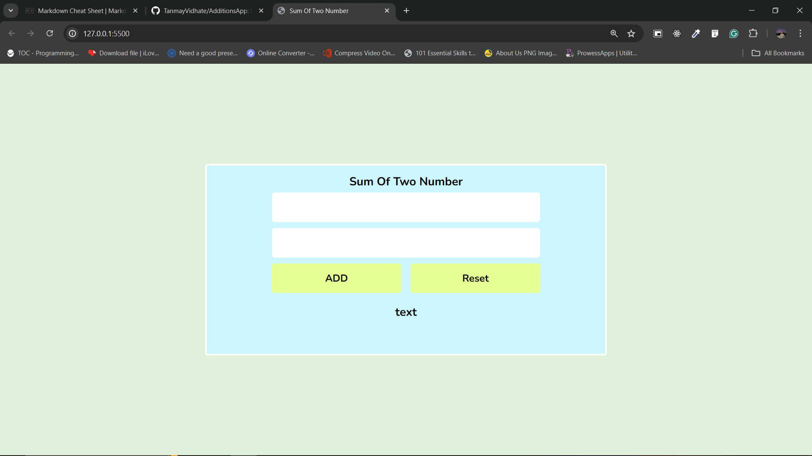

# Sum Of Two Number ✍

Website is use for to perform the addition of two numbers.User can enter the numbers in given textbox and get output additions of two numbers. *HTML*,*CSS*,and *JavaScript* technology are use for to build the website.

ADD button is call the javascript functions.In function perform the additions of two numbers and display the output in below paragraph tag.And with help of Reset button user reset textbox value.  

---

